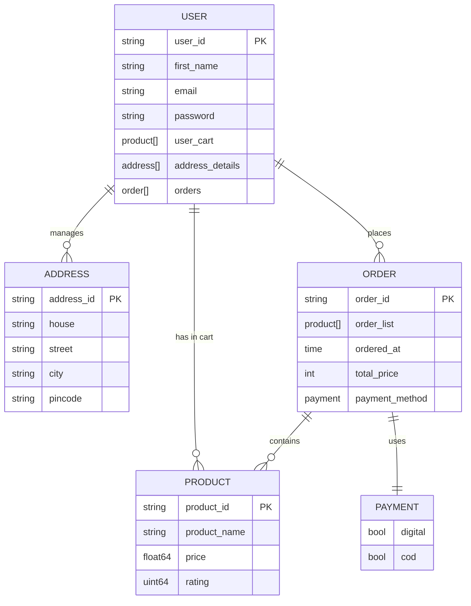

# Go Ecommerce Cart 🛒

A robust and scalable Ecommerce Backend built with **Golang**, **Gin Framework**, and **MongoDB**. This project provides a complete set of RESTful APIs for user authentication, product management, shopping cart operations, and address handling.

---

## 🚀 Features

-   **User Authentication**: Secure Sign-up and Login using JWT tokens and bcrypt password hashing.
-   **Product Management**: Search products by name, view all products, and admin-only product additions.
-   **Shopping Cart**: Add/Remove items, view cart, and instant-buy options.
-   **Address Management**: Add, edit (Home/Work), and delete shipping addresses.
-   **Order Processing**: Complete checkout flow with order history tracking.

---

## 🛠 Tech Stack

-   **Language**: [Go (Golang)](https://golang.org/)
-   **Web Framework**: [Gin Gonic](https://gin-gonic.com/)
-   **Database**: [MongoDB](https://www.mongodb.com/)
-   **Authentication**: JWT (JSON Web Tokens)
-   **Validation**: Go-Playground Validator

---

## 📂 Project Structure

```bash
.
├── controllers     # Request handlers & Business logic
├── database        # DB connection & Configuration
├── helpers         # Utility functions & Token management
├── middleware      # Auth middleware
├── models          # Database schemas & Structs
├── routes          # API route definitions
├── main.go         # Entry point
└── .env            # Environment variables
```

---

## 🔄 Structure Flow

1.  **Main Entry (`main.go`)**: Initializes the MongoDB connection, sets up the Gin router, and registers all routes.
2.  **Routing Layer**: Separates public routes (Login/Signup) from protected routes that require authentication.
3.  **Middleware Layer**: Intercepts requests to validate JWT tokens, ensuring secure access to user-specific data.
4.  **Controller Layer**: Processes incoming requests, validates input data, and invokes database operations.
5.  **Database Layer**: Interacts with MongoDB collections using the official `mongo-driver`.

---

## 📊 Entity Relations

The following diagram illustrates the relationships between the core entities in the system:



---

## 🛣 API Endpoints

### User & Auth
-   `POST /user/signup` - Register a new user
-   `POST /user/login` - Authenticate and get tokens

### Product
-   `GET /user/productview` - List all products
-   `GET /user/search?name=...` - Search products by query
-   `POST /admin/addproduct` - Add a new product (Admin only)

### Cart
-   `GET /cart/add?id=...` - Add item to cart
-   `GET /cart/remove?id=...` - Remove item from cart
-   `GET /cart` - View current user cart
-   `GET /cartcheckout` - Checkout cart
-   `GET /instantbuy?id=...` - Instant purchase

### Address
-   `POST /address/add` - Add new address
-   `PUT /address/edithome` - Update home address
-   `PUT /address/editwork` - Update work address
-   `GET /address/delete` - Remove an address

---

## ⚙️ Setup & Installation

1.  **Clone the repository**:
    ```bash
    git clone https://github.com/your-username/go_ecommerce_cart.git
    cd go_ecommerce_cart
    ```

2.  **Environment Variables**: Create a `.env` file and add your MongoDB URI and port:
    ```env
    PORT=8000
    MONGO_URL=mongodb://localhost:27017
    SECRET_KEY=your_secret_key
    ```

3.  **Install Dependencies**:
    ```bash
    go mod download
    ```

4.  **Run the Application**:
    ```bash
    go run main.go
    ```